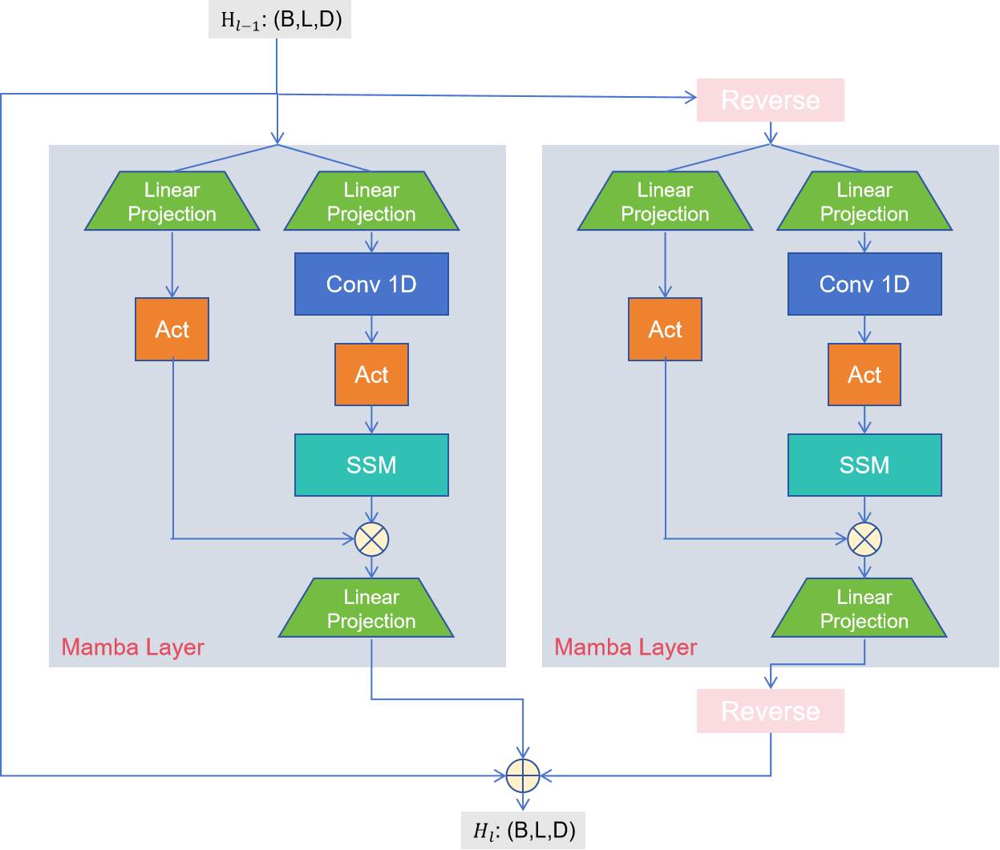
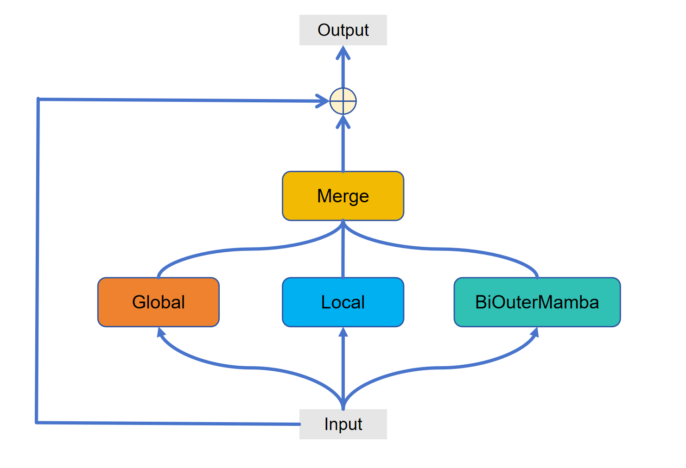

# 18781Project: Mamba E-Branchformer
This is the CMU course Speech Recognition Project

This repository contains the official implementation of Mamba in E-Branchformer, thanks to the code from https://github.com/Tonyyouyou/Mamba-in-Speech with paper [Mamba in Speech: Towards an Alternative to Self-Attention](https://arxiv.org/abs/2405.12609). Also, thanks to the code framework from [ESPnet](https://github.com/espnet/espnet)


## Install the Mamba
To build your ConBiMamba Model, you first need to install Mamba. The causal-conv1d component, which requires CUDA version 11.8 or higher, is essential for Mamba.

1. Install the `causal-conv1d` package:
    ```bash
    pip install causal-conv1d>=1.2.0
    ```
2. Install the `mamba-ssm` package:
    ```bash
    pip install mamba-ssm
    ```

## ESPnet version of Mamba
The following files are used for implementing ASR tasks in ESPnet.

### outer_bimamba.py
This file contains bidirectional outer mamba. should be placed in /mamba_ssm/modules(in your enviroment package of mamba)

### e_branchformer_encoder_mamba.py (this is the file for E-branchformer encoder with self-attention replaced by mamba layer, in this version we only used outer_bimamba)
should be placed in espnet/espnet2/asr/encoder

### e_branchformer_encoder_mamba_parallel.py (this is the file for E-branchformer encoder adding another bimamba branch, in this version we only used outer_bimamba)
should be placed in espnet/espnet2/asr/encoder

### asr.py
This is asr.py file, which should be in espnet/espnet2/tasks

### train_asr_e_branchformermamba.yaml
This file is the example training config file, showing the required parameters for training Mamba based E-Branchformer Arch.

### train_asr_e_branchformermambaparallel.yaml
This file is the example training config file, showing the required parameters for training E-Branchformer Mamba parellel Arch.

## Model Architecture

<figure>
    
    <figcaption>
        <strong>Figure 1:</strong> External Bidirectional Mamba layer: Two common Mamba
        layers are applied to process the forward and backward input, ”Act“
    means SiLU activation.
    </figcaption>
</figure>

<figure>
    
    <figcaption>
        <strong>Figure 2:</strong> E-Branchformer Mamba Parallel Structure.
    </figcaption>
</figure>

## Project Report
For detailed analysis and results, please check our [final project report](https://drive.google.com/file/d/1CkGe8dIdvFGuoh6ofdI5hbaz4QGMK-en/view?usp=drive_link).